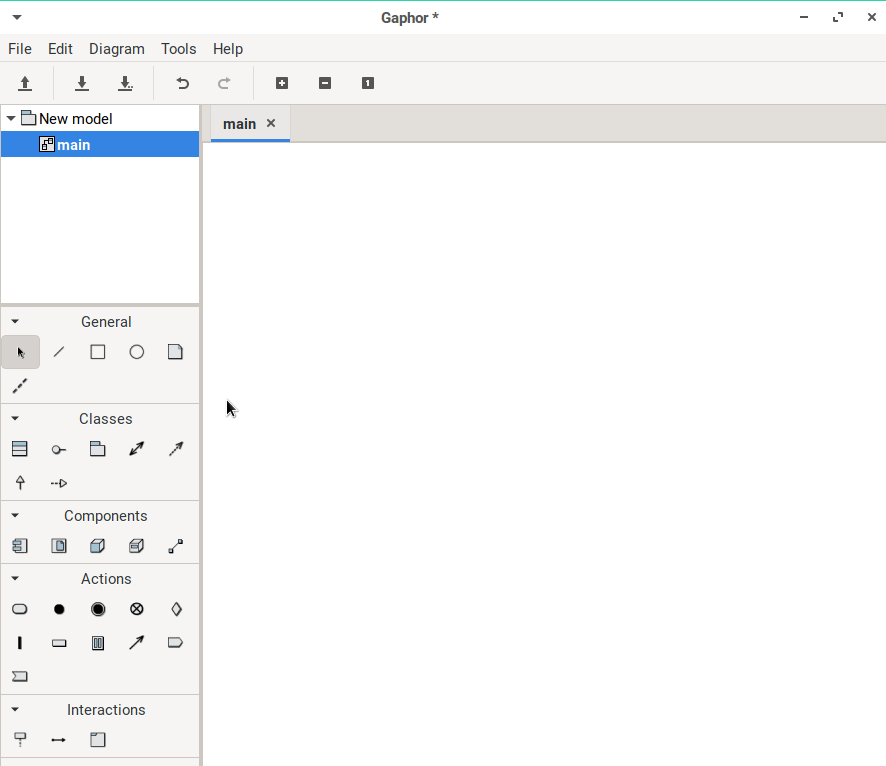

# Gaphor
[](#contributors)

[](https://travis-ci.com/gaphor/gaphor)

[](https://coveralls.io/github/gaphor/gaphor?branch=master)
[](https://pypi.org/project/gaphor)
[](https://pepy.tech/project/gaphor)
[](https://github.com/ambv/black)
[](https://github.com/RichardLitt/standard-readme)
[](https://gitter.im/Gaphor/Lobby?utm_source=badge&utm_medium=badge&utm_campaign=pr-badge&utm_content=badge)
[](#contributors)

> Gaphor is the simple modeling tool for UML.



Gaphor is a simple and easy to use modeling tool for UML. It is aimed at
beginning modelers who want a simple and fast tool so that they can focus on
learning modeling of software and systems. It is not a full featured enterprise
tool.

## :bookmark_tabs: Table of Contents

- [Background](#background)
- [Install](#install)
- [Usage](#usage)
- [API](#api)
- [Contributing](#contributing)
- [License](#license)

## :scroll: Background

Gaphor was built to provide the foundational diagramming portions of
[Gaphor](https://github.com/gaphor/gaphor). Since Gaphor is built on GTK+ and
cairo, [PyGObject](https://pygobject.readthedocs.io/) provides access to the
GUI toolkit, and [PyCairo](https://pycairo.readthedocs.io/) to the 2D graphics
library. However, there wasn't a project that abstracted these technologies to
easily create a diagramming tool.

Here is how it works:
- Items (canvas items) can be added to a Canvas.
- The canvas maintains the tree structure (parent-child relationships between
  items).
- A constraint solver is used to maintain item constraints and inter-item
  constraints.
- The item (and user) should not be bothered with things like bounding-box
  calculations.
- Very modular: e.g. handle support could be swapped in and swapped out.
- Rendering using Cairo.

The main portions of the library include:
 - canvas - The main canvas class (container for Items).
 - items - Objects placed on a Canvas.
 - solver - A constraint solver to define the layout and connection of items.
 - view - Responsible for the calculation of bounding boxes which is stored in a quadtree data structure for fast access.
 - gtkview - A view to be used in GTK+ applications that interacts with users with tools.
 - painters - The workers used to paint items.
 - tools - Tools are used to handle user events (such as mouse movement and button presses).
 - aspects - Provides an intermediate step between tools and items.

## :floppy_disk: Install

To install Gaphor in Linux use Flatpak:

1. [Install Flatpak](https://flatpak.org/setup)
1. `flatpak remote-add --user --if-not-exists flathub https://dl.flathub.org/repo/flathub.flatpakrepo`
1. `flatpak install --user org.gaphor.Gaphor`

We are currently working on installation packages for Windows and macOS. Until
that is ready, you can install  Gaphor, using pip:

```bash
$ pip install --pre gaphor
```

Use of a
[virtual environment](https://packaging.python.org/tutorials/installing-packages/#creating-virtual-environments)
is highly recommended.

### Development

To setup a development environment with Linux:
```bash
$ sudo apt-get install -y python3-dev python3-gi python3-gi-cairo
    gir1.2-gtk-3.0 libgirepository1.0-dev libcairo2-dev
$ pip install poetry
$ poetry install
```

## :flashlight: Usage


## :mag: API


## :heart: Contributing

Thanks goes to these wonderful people ([emoji key](https://github.com/kentcdodds/all-contributors#emoji-key)):

<!-- ALL-CONTRIBUTORS-LIST:START - Do not remove or modify this section -->
<!-- prettier-ignore -->
| [<br /><sub><b>Arjan Molenaar</b></sub>](https://github.com/amolenaar)<br />[💻](https://github.com/danyeaw/gaphor/commits?author=amolenaar "Code") [🐛](https://github.com/danyeaw/gaphor/issues?q=author%3Aamolenaar "Bug reports") [📖](https://github.com/danyeaw/gaphor/commits?author=amolenaar "Documentation") [👀](#review-amolenaar "Reviewed Pull Requests") [💬](#question-amolenaar "Answering Questions") [🐛](https://github.com/danyeaw/gaphor/issues?q=author%3Aamolenaar "Bug reports") [🔌](#plugin-amolenaar "Plugin/utility libraries") [⚠️](https://github.com/danyeaw/gaphor/commits?author=amolenaar "Tests") | [<br /><sub><b>wrobell</b></sub>](https://github.com/wrobell)<br />[💻](https://github.com/danyeaw/gaphor/commits?author=wrobell "Code") [⚠️](https://github.com/danyeaw/gaphor/commits?author=wrobell "Tests") [🎨](#design-wrobell "Design") | [<br /><sub><b>Dan Yeaw</b></sub>](https://ghuser.io/danyeaw)<br />[💻](https://github.com/danyeaw/gaphor/commits?author=danyeaw "Code") [⚠️](https://github.com/danyeaw/gaphor/commits?author=danyeaw "Tests") [📖](https://github.com/danyeaw/gaphor/commits?author=danyeaw "Documentation") [📦](#platform-danyeaw "Packaging/porting to new platform") [🚇](#infra-danyeaw "Infrastructure (Hosting, Build-Tools, etc)") [🐛](https://github.com/danyeaw/gaphor/issues?q=author%3Adanyeaw "Bug reports") [💬](#question-danyeaw "Answering Questions") |
| :---: | :---: | :---: |
<!-- ALL-CONTRIBUTORS-LIST:END -->

This project follows the
[all-contributors](https://github.com/kentcdodds/all-contributors)
specification. Contributions of any kind are welcome!

1.  Check for open issues or open a fresh issue to start a discussion
    around a feature idea or a bug. There is a 
    [first-timers-only](https://github.com/gaphor/gaphor/issues?utf8=%E2%9C%93&q=is%3Aissue+is%3Aopen+label%3Afirst-timers-only)
    tag for issues that should be ideal for people who are not very
    familiar with the codebase yet.
2.  Fork [the repository](https://github.com/gaphor/gaphor) on
    GitHub to start making your changes to the **master** branch (or
    branch off of it).
3.  Write a test which shows that the bug was fixed or that the feature
    works as expected.
4.  Send a pull request and bug the maintainers until it gets merged and
    published. :smile:

See [the contributing file](CONTRIBUTING.md)!


## :copyright: License
Copyright (C) Arjan Molenaar and Dan Yeaw

Licensed under the [Library General Public License 2.0](LICENSE.txt).

Summary: You can copy, distribute, or modify Gaphor, as long as you include the
required notices and license them under the LGPL.

## Contributors

Thanks goes to these wonderful people ([emoji key](https://github.com/kentcdodds/all-contributors#emoji-key)):

<!-- ALL-CONTRIBUTORS-LIST:START - Do not remove or modify this section -->
<!-- prettier-ignore -->
<!-- ALL-CONTRIBUTORS-LIST:END -->

This project follows the [all-contributors](https://github.com/kentcdodds/all-contributors) specification. Contributions of any kind welcome!