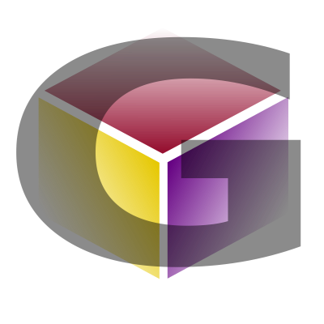

# Gaphor 

[](https://dev.azure.com/gaphor-dev/gaphor/_build/latest?definitionId=2&branchName=master)

[](https://coveralls.io/github/gaphor/gaphor?branch=master)
[](https://pypi.org/project/gaphor)
[](https://pepy.tech/project/gaphor)
[](https://github.com/ambv/black)
[](https://github.com/RichardLitt/standard-readme)
[](https://gitter.im/Gaphor/Lobby?utm_source=badge&utm_medium=badge&utm_campaign=pr-badge&utm_content=badge)
[](#contributors)


> Gaphor is the simple modeling tool for UML.


Gaphor is a simple and easy to use modeling tool for UML. It is aimed at
beginning modelers who want a simple and fast tool so that they can focus on
learning modeling of software and systems. It is not a full featured enterprise
tool.

## :bookmark_tabs: Table of Contents

- [Background](#background)
- [Install](#install)
- [Usage](#usage)
- [Contributing](#contributing)
- [License](#license)

## :scroll: Background

Gaphor is a UML modeling application written in Python. It is designed to be
easy to use, while still being powerful. Gaphor implements a fully-compliant UML
2 data model, so it is much more than a picture drawing tool. You can use Gaphor
to quickly visualize different aspects of a system as well as create complete,
highly complex models.

Gaphor is designed around the following principles:

- Simplicity: The application should be easy to use. Only some basic knowledge of UML is required.
- Consistency: UML is a graphical modeling language, so all modeling is done in a diagram.
- Workability: The application should not bother the user every time they do something non-UML-ish.

Gaphor is built on [Gaphas](https://github.com/gaphor/gaphas), which provides
the foundational diagramming library. It is a GUI application that is built on
GTK and cairo, [PyGObject](https://pygobject.readthedocs.io/) provides access
to the GUI toolkit, and [PyCairo](https://pycairo.readthedocs.io/) to the 2D
graphics library.

## :floppy_disk: Install

### Windows
To install Gaphor on Windows you an use the [latest Gaphor.exe installer](https://github.com/gaphor/gaphor/releases).
There are two versions:
1. Full Windows installation
2. Portable installation

### Linux
To install Gaphor in Linux use Flatpak:
1. [Install Flatpak](https://flatpak.org/setup)
1. `flatpak remote-add --user --if-not-exists flathub https://dl.flathub.org/repo/flathub.flatpakrepo`
1. `flatpak install --user flathub org.gaphor.Gaphor`

Alternatively, you can download the [latest
gaphor-linux.tar.gz](https://github.com/gaphor/gaphor/releases).

### macOS
We are still working on packaging GTK with Gaphor and it is currently an
installation pre-requisite.
1. Install [homebrew](https://brew.sh)
1. Open a terminal and execute:
```bash
$ brew install gobject-introspection gtk+3
```

Then install Gaphor on macOS using the [latest gaphor-macOS.dmg
installer](https://github.com/gaphor/gaphor/releases).


Note: Sometimes launching the app the first time after installation fails due
to macOS security settings, please attempt to launch it a 2nd time if this
happens.

### PyPI
You can also install Gaphor using a wheel from PyPI.

On Ubuntu 18.04, make sure the following packages are installed:

* libcairo2-dev
* libgirepository1.0-dev
* gobject-introspection (a dependency of libgirepository1.0-dev)

GTK+ 3.x is installed by default.

```bash
$ pip install gaphor
$ gaphor
```
Use of a
[virtual environment](https://packaging.python.org/tutorials/installing-packages/#creating-virtual-environments)
is highly recommended.

### Development

#### Windows

NOTE: Use of virtual environments with msys2 is currently
[broken](https://github.com/msys2/MINGW-packages/issues/5001).
To setup a development environment in Windows:
1) Go to http://www.msys2.org/ and download the x86_64 installer
1) Follow the instructions on the page for setting up the basic environment
1) Run ``C:\msys64\mingw64.exe`` - a terminal window should pop up
```bash
$ pacman -Suy
$ pacman -S mingw-w64-x86_64-gtk3 mingw-w64-x86_64-python3-gobject mingw-w64-x86_64-python3-cairo
$ pacman -S mingw-w64-x86_64-python3-pip mingw-w64-x86_64-python3-setuptools
```
Install git if it isn't already installed in msys2 with `pacman -S git`

git clone the repository to C:\msys64\home\<user>
```bash
$ cd gaphor
$ pip3 install -e .
```

#### Linux
To setup a development environment with Linux:
```bash
$ sudo apt-get install -y python3-dev python3-gi python3-gi-cairo
    gir1.2-gtk-3.0 libgirepository1.0-dev libcairo2-dev
$ source ./venv
```

#### macOS
To setup a development environment with macOS:
1. Install [homebrew](https://brew.sh)
1. Open a terminal and execute:
```bash
$ brew install gobject-introspection gtk+3
$ source ./venv
```

## :flashlight: Usage
### Creating models

Once Gaphor is started a new empty model is automatically created. The main
diagram is already open in the Diagram section.

Select an element you want to place, for example a Class, by clicking on the icon in
the Toolbox and click on the diagram. This will place a new
Class item instance on the diagram and add a new Class to the model (it shows
up in the Navigation). The selected tool will reset itself to
the Pointer tool if the option ''Diagram -> Reset tool'' is selected.

Some elements are not directly visible. The section in the toolbox is collapsed
and needs to be clicked first to reveal its contents.

Gaphor only has one diagram type, and it does not enforce which elements should
be placed on a diagram.

### Create a New Diagram

1. Use the Navigation to select an element that can contain a diagram (a
Package or Profile)
1. Select Diagram, and New diagram. A new diagram is created.

### Copy and Paste

Items in a diagram can be copied and pasted in the same diagram or other
diagrams. Pasting places an existing item in the diagram, but the item itself
is not duplicated. In other words, if you paste a Class object in a diagram,
the Class will be added to the diagram, but there will be no new Class in the
Navigation.

### Drag and Drop

Adding an existing element to a diagram is done by dragging the element from
the Navigation section onto a diagram. Diagrams and attribute/operations of a
Class show up in the Navigation but can not be added to a diagram.

Elements can also be dragged within the Navigation in order to rearrange them
in to different packages.


## :heart: Contributing

Thanks goes to these wonderful people ([emoji key](https://github.com/kentcdodds/all-contributors#emoji-key)):

<!-- ALL-CONTRIBUTORS-LIST:START - Do not remove or modify this section -->
<!-- prettier-ignore -->
| [<br /><sub><b>Arjan Molenaar</b></sub>](https://github.com/amolenaar)<br />[💻](https://github.com/danyeaw/gaphor/commits?author=amolenaar "Code") [🐛](https://github.com/danyeaw/gaphor/issues?q=author%3Aamolenaar "Bug reports") [📖](https://github.com/danyeaw/gaphor/commits?author=amolenaar "Documentation") [👀](#review-amolenaar "Reviewed Pull Requests") [💬](#question-amolenaar "Answering Questions") [🐛](https://github.com/danyeaw/gaphor/issues?q=author%3Aamolenaar "Bug reports") [🔌](#plugin-amolenaar "Plugin/utility libraries") [⚠️](https://github.com/danyeaw/gaphor/commits?author=amolenaar "Tests") | [<br /><sub><b>wrobell</b></sub>](https://github.com/wrobell)<br />[💻](https://github.com/danyeaw/gaphor/commits?author=wrobell "Code") [⚠️](https://github.com/danyeaw/gaphor/commits?author=wrobell "Tests") [🐛](https://github.com/danyeaw/gaphor/issues?q=author%3Awrobell "Bug reports") [🎨](#design-wrobell "Design") | [<br /><sub><b>Dan Yeaw</b></sub>](https://ghuser.io/danyeaw)<br />[💻](https://github.com/danyeaw/gaphor/commits?author=danyeaw "Code") [⚠️](https://github.com/danyeaw/gaphor/commits?author=danyeaw "Tests") [📖](https://github.com/danyeaw/gaphor/commits?author=danyeaw "Documentation") [📦](#platform-danyeaw "Packaging/porting to new platform") [🚇](#infra-danyeaw "Infrastructure (Hosting, Build-Tools, etc)") [🐛](https://github.com/danyeaw/gaphor/issues?q=author%3Adanyeaw "Bug reports") [💬](#question-danyeaw "Answering Questions") | [<br /><sub><b>melisdogan</b></sub>](https://github.com/melisdogan)<br />[📖](https://github.com/danyeaw/gaphor/commits?author=melisdogan "Documentation") | [<br /><sub><b>Adam Boduch</b></sub>](http://www.boduch.ca)<br />[💻](https://github.com/danyeaw/gaphor/commits?author=adamboduch "Code") [⚠️](https://github.com/danyeaw/gaphor/commits?author=adamboduch "Tests") [🐛](https://github.com/danyeaw/gaphor/issues?q=author%3Aadamboduch "Bug reports") | [<br /><sub><b>Enno Gröper</b></sub>](https://github.com/egroeper)<br />[💻](https://github.com/danyeaw/gaphor/commits?author=egroeper "Code") | [<br /><sub><b>JensPfeifle</b></sub>](https://pfeifle.tech)<br />[📖](https://github.com/danyeaw/gaphor/commits?author=JensPfeifle "Documentation") |
| :---: | :---: | :---: | :---: | :---: | :---: | :---: |
| [<br /><sub><b>Alexis Howells</b></sub>](http://www.aejh.co.uk)<br />[📖](https://github.com/danyeaw/gaphor/commits?author=aejh "Documentation") | [<br /><sub><b>Encolpe DEGOUTE</b></sub>](http://encolpe.wordpress.com)<br />[🌍](#translation-encolpe "Translation") | [<br /><sub><b>Christian Hoff</b></sub>](https://github.com/choff)<br />[💻](https://github.com/danyeaw/gaphor/commits?author=choff "Code") | [<br /><sub><b>Jordi Mallach</b></sub>](https://oskuro.net/)<br />[🌍](#translation-jmallach "Translation") | [<br /><sub><b>Tony</b></sub>](https://github.com/tonytheleg)<br />[🚧](#maintenance-tonytheleg "Maintenance") | [<br /><sub><b>Jan</b></sub>](https://github.com/jischebeck)<br />[🐛](https://github.com/danyeaw/gaphor/issues?q=author%3Ajischebeck "Bug reports") | [<br /><sub><b>Brock Tibert</b></sub>](http://btibert3.github.io)<br />[🐛](https://github.com/danyeaw/gaphor/issues?q=author%3ABtibert3 "Bug reports") |
| [<br /><sub><b>Rafael Muñoz Cárdenas</b></sub>](http://www.rmunoz.net)<br />[🐛](https://github.com/danyeaw/gaphor/issues?q=author%3AMenda "Bug reports") | [<br /><sub><b>Mikhail Bessonov</b></sub>](https://github.com/mbessonov)<br />[🐛](https://github.com/danyeaw/gaphor/issues?q=author%3Ambessonov "Bug reports") | [<br /><sub><b>Kapil Thangavelu</b></sub>](http://twitter.com/kapilvt)<br />[🐛](https://github.com/danyeaw/gaphor/issues?q=author%3Akapilt "Bug reports") | [<br /><sub><b>DimShadoWWW</b></sub>](https://github.com/DimShadoWWW)<br />[🐛](https://github.com/danyeaw/gaphor/issues?q=author%3ADimShadoWWW "Bug reports") | [<br /><sub><b>Nedko Arnaudov</b></sub>](http://nedko.arnaudov.name)<br />[🐛](https://github.com/danyeaw/gaphor/issues?q=author%3Anedko "Bug reports") | [<br /><sub><b>Alexander Wilms</b></sub>](https://github.com/Alexander-Wilms)<br />[🐛](https://github.com/danyeaw/gaphor/issues?q=author%3AAlexander-Wilms "Bug reports") |
<!-- ALL-CONTRIBUTORS-LIST:END -->

This project follows the
[all-contributors](https://github.com/kentcdodds/all-contributors)
specification. Contributions of any kind are welcome!

1.  Check for open issues or open a fresh issue to start a discussion
    around a feature idea or a bug. There is a
    [first-timers-only](https://github.com/gaphor/gaphor/issues?utf8=%E2%9C%93&q=is%3Aissue+is%3Aopen+label%3Afirst-timers-only)
    tag for issues that should be ideal for people who are not very
    familiar with the codebase yet.
2.  Fork [the repository](https://github.com/gaphor/gaphor) on
    GitHub to start making your changes to the **master** branch (or
    branch off of it).
3.  Write a test which shows that the bug was fixed or that the feature
    works as expected.
4.  Send a pull request and bug the maintainers until it gets merged and
    published. :smile:

See [the contributing file](CONTRIBUTING.md)!


## :copyright: License
Copyright (C) Arjan Molenaar and Dan Yeaw

Licensed under the [Apache License v2](LICENSE.txt).

Summary: You can do what you like with Gaphor, as long as you include the
required notices. This permissive license contains a patent license from the
contributors of the code.
