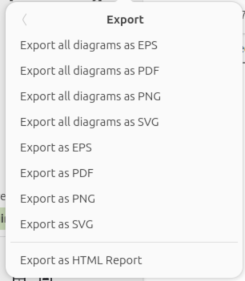
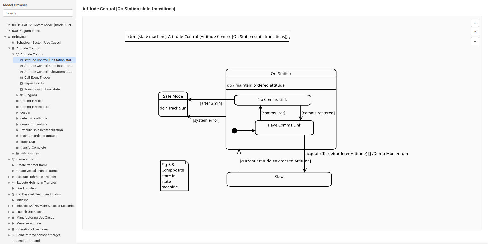

# Exporting

Gaphor can export diagrams and models in several formats, from individual
diagram images to full interactive HTML reports.

## Diagram Image Export

Gaphor supports exporting diagrams as SVG, PNG, PDF, and EPS
images.

### From the GUI

Open the hamburger menu and choose one of:

- Export as SVG/PNG/PDF — exports the currently active diagram
- Export all diagrams — batch-exports every diagram in the model

Batch export preserves the package directory structure, so diagrams inside
nested packages end up in matching subdirectories.

### From the command line

```console
$ gaphor export model.gaphor
```

This exports all diagrams to PDF (the default format) in the current directory.

Common options:

| Option                    | Description                                                                                   |
|---------------------------|-----------------------------------------------------------------------------------------------|
| `-f`, `--format` _format_ | Output format: `svg`, `png`, `pdf` (default), or `eps`                                        |
| `-o`, `--dir` _directory_ | Output directory                                                                              |
| `-r`, `--regex` _pattern_ | Only export diagrams whose name matches the pattern (case-insensitive, includes package name) |
| `-u`, `--use-underscores` | Use underscores instead of spaces in output filenames                                         |

For example, to export only diagrams with "Class" in their name as SVG:

```console
$ gaphor export -f svg -r "class" -o ./output model.gaphor
```

## HTML Report

The HTML report is a self-contained, single-page report that gives an
interactive, read-only overview of your entire model — ideal for sharing with
stakeholders or publishing on a static site (GitHub Pages, etc.).

Features:

- Sidebar tree with search for quick navigation
- Interactive SVG diagrams with pan and zoom
- Clickable elements — click any element in a diagram to see its details
- Detail panels showing element properties and relationships

```{note}
The generated report is fully static. No server or backend is required to view it.
```

### Generating via the GUI

Open the hamburger menu and choose `Export as HTML Report`.



### Generating via the command line

```console
$ gaphor html-report model.gaphor -o report-output
```

| Option                    | Description                     |
|---------------------------|---------------------------------|
| `-o`, `--dir` _directory_ | Output directory for the report |


