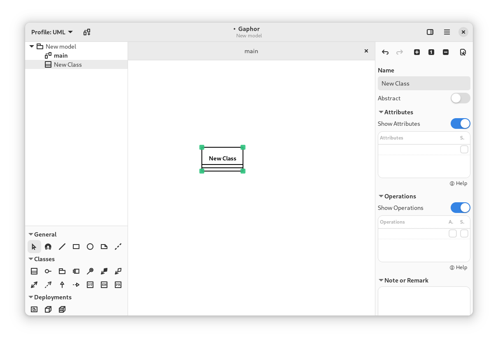
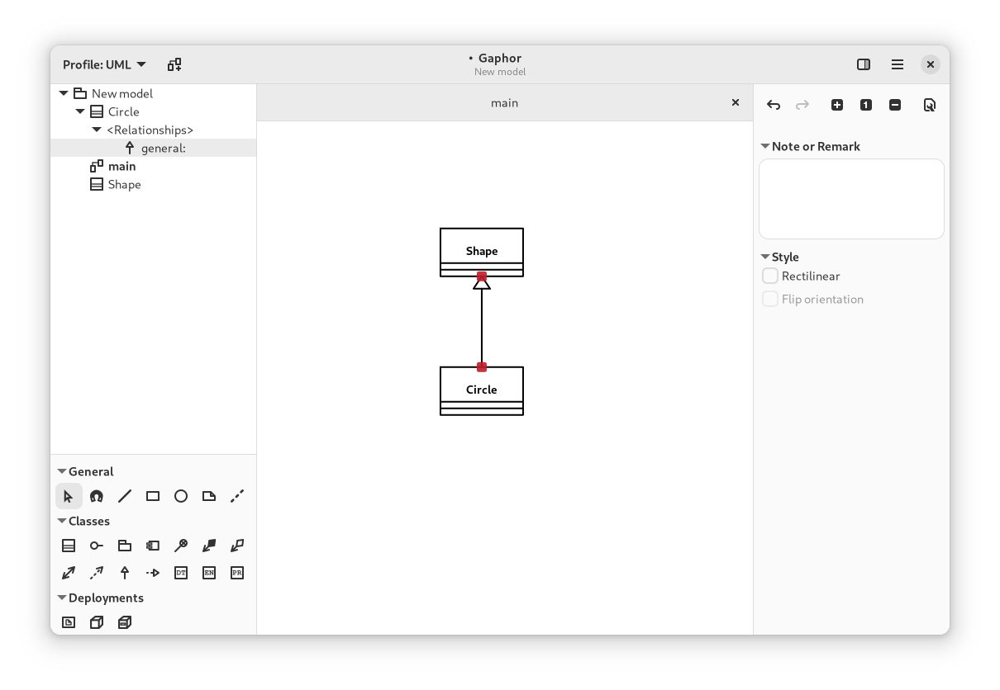
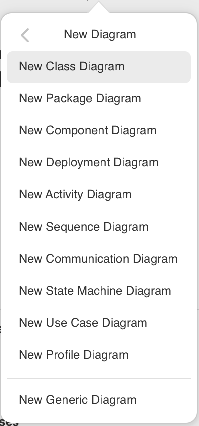

# Your First Model

```{note}
In this tutorial we refer to the different parts of the gaphor interface:
{ref}`Model Browser <getting_started:model browser>`, [Toolbox](getting_started:toolbox),
{ref}`Property Editor <getting_started:property editor>`.

Although the names should speak for themselves, you can check out the [Getting
Started](getting_started) page for more information.
```

Once Gaphor is started, and you can start a new model with the _Generic_ template. The
initial diagram is already open in the Diagram section.

Select an element you want to place, in this case a Class ()
by clicking on the icon in the Toolbox and click on the diagram. This will place
a new Class item instance on the diagram and add a new Class to the model -- it
shows up in the Model Browser. The selected tool will reset itself to the
Pointer tool after the element is placed on the diagram.

The Property Editor on the right side will show you details about the newly added
class, such as its name (_New Class_), attributes and operations (methods).
The Note field can contain any text you wish to associate with the element, (this will not show on a diagram).



It's simple to add elements to a diagram.

Gaphor does not make any assumptions about which elements should be
placed on a diagram. A diagram is a diagram. UML defines all different
kinds of diagrams, such as Class diagrams, Component diagrams, Action
diagrams, Sequence diagrams. But Gaphor does not place any restrictions.

## Adding Relations

Add another Class. Change the names to `Shape` and `Circle`. Let's define that
`Circle` is a sub-type of `Shape`. You can do this by selecting one and changing
the name in the Property Editor, or by double-clicking the element.

Select Generalization ().

Move the mouse cursor over `Shape`. Click, hold and drag the line end over
`Circle`. Release the mouse button, and you should have your relationship between
`Shape` and `Circle`. You can see both ends of the relation are red, indicating
they are connected to their class.



Optionally you can run the auto-layout (
→ Tools → Auto Layout) to align the
elements on the diagram.

## Creating New Diagrams

To create a new diagram, use the Model Browser. Select the element that should
contain the new diagram. For now, select _New Model_.
Click the New Diagram menu () in the header bar.



Select _New Generic Diagram_ and a new diagram is created.

Now drag the elements from the Model Browser onto the new diagram. First the
classes `Shape` and `Circle`. Add the generalization last. Drop it somewhere
between the two classes. The relation will be created to the diagram.

Now change the name of class `Circle` to `Ellipse`. Check the other diagram. The
name has been changed there as well.


```{important}
Elements in a diagram are only a _representation_ of the elements in the
underlying model. The model is what you see in the Model Browser.

Elements in the model are automatically removed when there are no more
representations in any of the diagrams.
```
## Examples of Gaphor models

### SysML Models
To see how a larger model comes together in Gaphor check out [Gaphor Distilled](https://github.com/mikekidner/gaphor_distilled) which implements the DELL-SAT-77 model used as the basis for [SysML Distilled](https://delligattiassociates.com/publications/?_gl=1*1tu6ekh*_ga*MTMwMTU4NjMyNC4xNzMyNTYyOTUw*_up*MQ..) one of the standard references for the SysML language.
