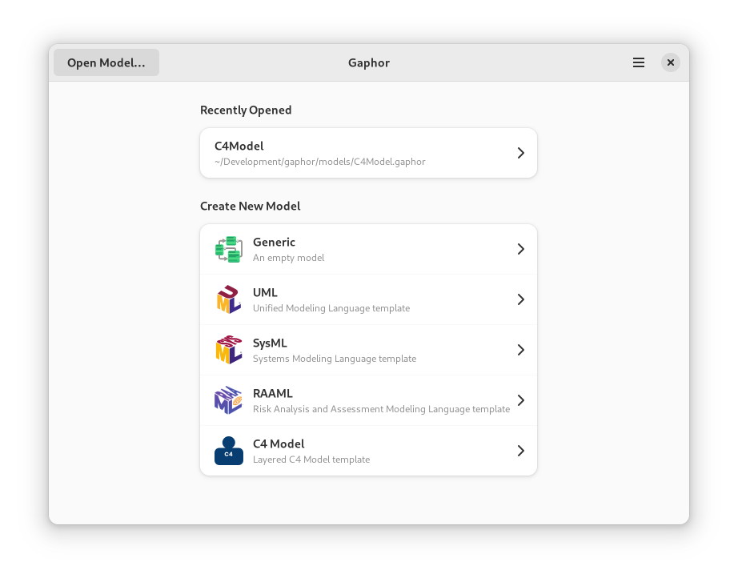
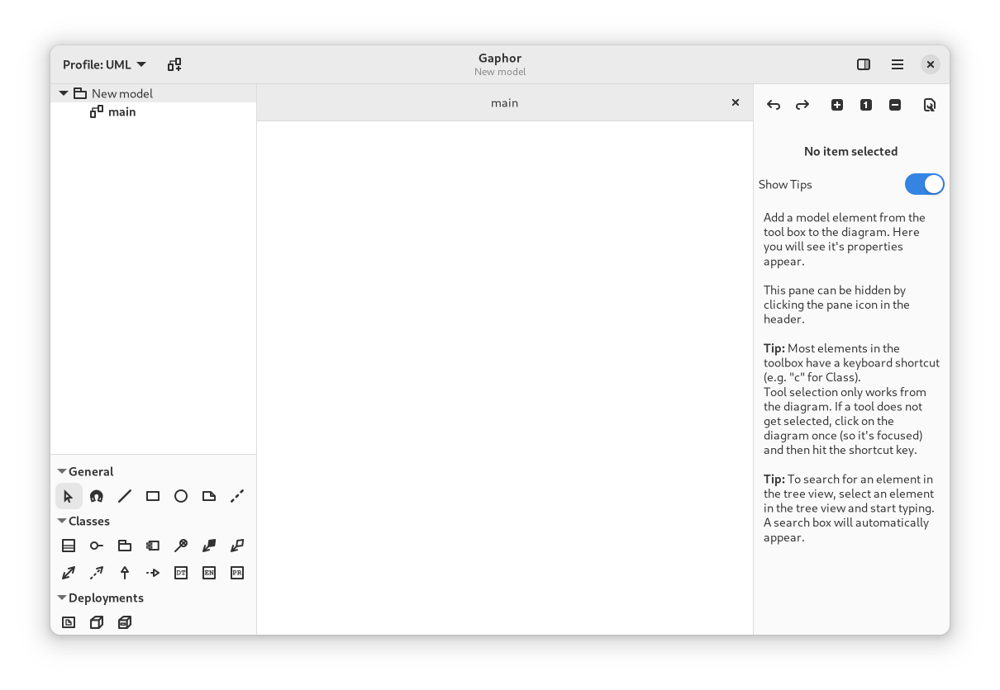

# Get Started with Gaphor

Gaphor is more than a diagram editor: it's a modeling environment.
Where simple diagram editors such as Microsoft Visio and [draw.io](https://draw.io)
allow you to create pictures, Gaphor actually keeps track of the elements you add
to the model. In Gaphor you can create diagrams to track and visualize different aspects
of the system you're developing.

Enough talk, let's get started.

You can find installers for Gaphor on the [Gaphor Website](https://gaphor.org/download). Gaphor can be installed on
Linux (Flatpak), Windows, and macOS.

Once Gaphor is launched, it provides you a welcome screen. It shows you
previously opened models and model templates.



You can select a template to get started.

- **Generic:** a blank model to start with
- **UML:** A template for the *Unified Modeling Language* for modeling a software system
- **SysML:** A template for the *Systems Modeling Language* for modeling a wide range of systems and systems-of-systems
- **RAAML:** A template for the *Risk Analysis and Assessment Modeling language* for safety and reliability analysis
- **C4 Model:** A template for *Context, Containers, Components, and Code* which is for lean modeling of software architecture

Once the model interface is loaded you'll see the modeling interface.



The layout of the Gaphor interface is divided into four sections,
namely:

1. Model Browser
2. Diagram Element Toolbox
3. Diagrams
4. Property Editor

Each section has its own specific function.

## Model Browser

The Model Browser section of the interface displays a hierarchical view of
your model. Every model element you create will be inserted into the
Model Browser. This view acts as a tree where you can expand and
collapse different elements of your model. This provides an easy way to
view the elements of your model from an elided perspective. That is, you
can collapse those model elements that are irrelevant to the task at
hand.

In the figure above, you will see that there are two elements in
the Model Browser. The root element, _New Model_ is a package. Notice
the small arrow beside _New Model_ that is pointing downward. This
indicates that the element is expanded. You will also notice the two
sub-elements are slightly indented in relation to _New Model_.
The _main_ element is a diagram.

In the Model Browser view, you can also right-click the model elements to
get a context menu. This context menu allows you to find out in which
diagram model elements are shown, add new diagrams and packages, and
delete an element.

Double-clicking on a diagram element will show it in the Diagram
section. Elements such as classes and packages can be dragged from the
tree view on the diagrams.

## Toolbox

The toolbox is used to add new items to a diagram. Select the element you want
to add by clicking on it. When you click on the diagram, the selected element is
created. The arrow is selected again, so the element can be manipulated.

Tools can be selected by simply left-clicking on them. By default, the pointer
tool is selected after every item placement. This can be changed by disabling
the "Reset tool" option in the Preferences window. Tools can also be selected by
keyboard shortcuts. The keyboard shortcut can be displayed as a tooltip by
hovering over the tool button in the toolbox. Finally, it is also possible to
drag elements on the Diagram from the toolbox.

## Diagrams

The diagram section contains diagrams of the model and takes up the most space
in the UI because it is where most of the modeling is done. Diagrams consist of
items placed on the diagram. There are two main types of items:

1. Elements
2. Relationships

Multiple diagrams can be opened at once: they are shown in tabs. Tabs can be
closed by pressing <kbd>Ctrl</kbd>+<kbd>w</kbd> or left-clicking on the x in the
diagram tab.

### Elements

Elements are the shapes that you add to a diagram, and together with Relations,
allow you to build up a model.

To resize an element on the diagram, left-click on the element to select it and
then drag the resize handles that appear at each corner.

To move an element on the diagram, drag the element where you want to place it
by pressing and holding the left mouse button, and moving the mouse before
releasing the button.

### Relations

Relations are line-like items that form relationships between elements in the
diagram. Each end of a relation is in one of two states:

1. Connected to an element and the handle turns red
2. Disconnected from an element and the handle turns green

If both ends of a relation are disconnected, the relation can be moved by
left-clicking and dragging it.

A new segment in a relation can be added by left-clicking on the relation to
select it and then by hovering your mouse over it. A green handle
will appear in the middle of the line segments that exist. Drag the handle to
add another segment. For example, when you first create a new relation, it will
have only one segment. If you drag the segment handle, then it will now have two
segments with the knee of the two segments where the handle was.

### Copy and Paste

As stated before, Gaphor is a modeling environment. This means that every _item_ in a diagram
is backed by a _model element_ found in the model browser. This means that you can show the same
_model element_ in different diagrams.

* <kbd>Ctrl</kbd>+<kbd>v</kbd> is used to paste _only_ the presentation element.
* <kbd>Ctrl</kbd>+<kbd>Shift</kbd>+<kbd>v</kbd> is used to paste a new presentation with a new model element.

```{important}
<kbd>Ctrl</kbd>+<kbd>v</kbd> does a "shallow" paste. <kbd>Ctrl</kbd>+<kbd>Shift</kbd>+<kbd>v</kbd> does a "deep" paste.
```

### Undo and Redo

Undo a change press <kbd>Ctrl</kbd>+<kbd>z</kbd> or left-click on the back arrow
at the top of the Property Editor. To re-do a change, hit
<kbd>Ctrl</kbd>+<kbd>Shift</kbd>+<kbd>z</kbd> or press the forward arrow at the
top of the Property Editor.

## Property Editor

The Property Editor is present on the right side of the diagrams. When no item
is selected in the diagram, it shows you some tips and tricks. When an item is
selected on the diagram, it contains the item details like name, attributes and
stereotypes. It can be opened with <kbd>F9</kbd> and the
 icon in
the header bar.

The properties that are shown depend on the item that is selected.

## Model Preferences

The Property Editor also contains model preferences: Click the 
button.

### Reset Tool Automatically

By default, the pointer tool is selected after an element is placed from the toolbox. If this option is turned off, the same type of element will be placed by clicking in the diagram until another element is selected in the toolbox.

### Remove Unused Elements

By default, elements that are not part of any diagram in the model will be removed. If this option is turned off, elements remain in the model and may be found in the model browser.

### Diagram Language

The diagram language modifier is only applicable to the loaded model and how it is shown in the diagram. The diagram language setting is saved as part of the model and defaults to English.

The UI language of Gaphor is controlled by the operating system.

```{note}
Gaphor considers the ``LANG`` environment variable on Linux, Windows and macOS.

On Windows and macOS it can be set independently of the operating system's language settings to a different language.
```
### Style Sheet

The [style sheet](style_sheets) allows to change the visual appearance of diagrams and model elements.
