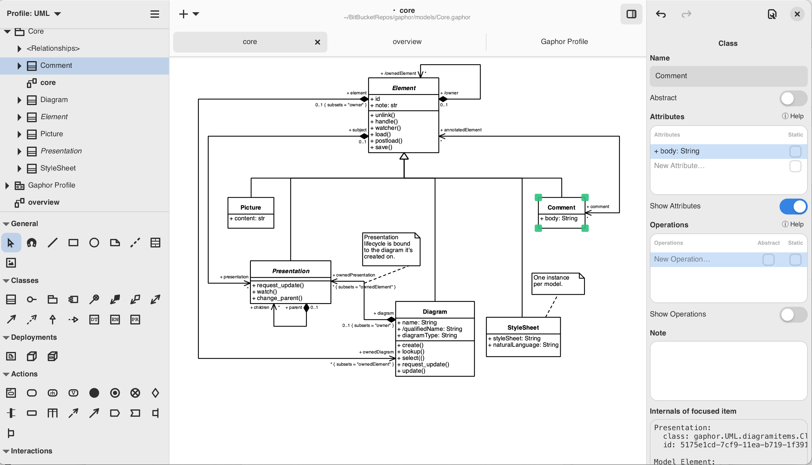

About Gaphor
============

.. note::

   The documentation is up to date for Gaphor |version|

Gaphor is a UML and SysML modeling application written in Python.
It is designed to be easy to use, while still being powerful.
Gaphor implements a fully-compliant UML 2 data model,
so it is much more than a picture drawing tool.

You can use Gaphor to quickly visualize different aspects of a system
as well as create complete, highly complex models.

Gaphor is 100% Open source. The code and issue tracker can be found on
`GitHub <https://github.com/gaphor/gaphor>`_.

What are you waiting for? :doc:`Get's get started <getting_started>`!

For download instructions, and the blog,
please visit the `Gaphor Website <https://gaphor.org>`_.

Gaphor has excellent integration with [Sphinx](sphinx) and [Jupyter notebooks](scripting).

.. toctree::
   :caption: Getting Started
   :hidden:

   getting_started
   first_model

.. toctree::
   :caption: Features
   :hidden:

   style_sheets
   sphinx
   scripting
   stereotypes

.. toctree::
   :caption: Installation
   :hidden:

   linux
   macos
   windows
   container

.. toctree::
   :caption: Modeling languages
   :hidden:

   models/core
   models/uml
   models/sysml
   models/raaml
   models/c4model

.. toctree::
   :caption: Concepts
   :hidden:

   design_principles
   framework
   service_oriented
   event_system
   modeling_language

.. toctree::
   :caption: Internals
   :hidden:

   connect
   storage
   undo
   transaction
