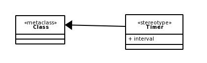
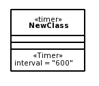
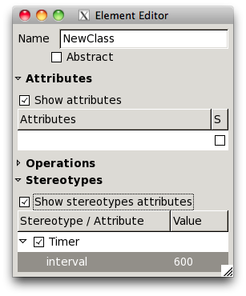

Extending models
================

The UML method to extend UML (basic) components with a special meaning is by
using stereotypes. A stereotype defines a special usage of a model element. For
example: a class that's used as a controller can be assigned a stereotype::

  «controller»

Creating a stereotype starts by the creation of a Profile normally. Although
stereotypes can be created in every package, it's a good habit to use Profiles
for that. Next a Metaclass has to be created. The metaclass will tell the
stereotype on which kind of elements it is applicable. A Stereotype can be
connected to the Metaclass by means of an Extension relationship.

Stereotypes can be applied to basically all elements in a model [1]_.

Stereotypes can contain attributes, as shown in the diagram above. Those
attributes can be filled in the Element Editor. This allows for enormous
flexibility. In most cases, especially if some sort of program logic has to be
generated from the models, it is very handy to define special behaviours to
classes and other elements by means of stereotypes.

.. [1] If for some reason the stereotype doesn't show in the diagram, raise a ticket ;)
