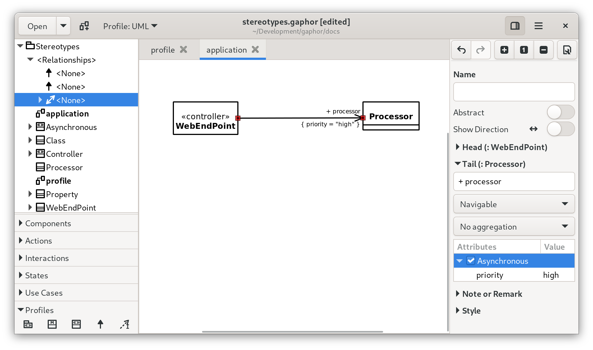

# Stereotypes

In UML, stereotypes are way to extend the application of the UML language to
new domains. For example: SysML started as a profile for UML.

Gaphor supports stereotypes too. They're *the* way for you to adapt your models
to your specific needs.

The UML, SysML, RAAML and other models used in Gaphor – the code is
generated from Gaphor model files – make use of stereotypes to provide
specific information used when generating the data model code.

To create a stereotype, ensure the UML Profile is active and open the *Profile*
section of the toolbox. First add a *Metaclass* to your diagram. Next add a
*Stereotype*, and connect both with a *Extension*.
The `«metaclass»` stereotype will only show once the *Extension* is connected
both class and stereotype.

```{note}
The class names in the metaclass should be a class name from the UML model,
such as `Class`, `Interface`, `Property`, `Association`.
Or even `Element` if you want to use the stereotype on all elements.
```

Your stereotype declaration may look something like this:

```{diagram} profile
:model: stereotypes
```

The `Asynchronous` stereotype has a property `priority`. This property can
be proved a value once the stereotype is applied to a *Property*, such as an
association end.

When a stereotype can be applied to a model element, a *Stereotype* section
will appear in the editor.



## Creating a profile

In SysML extending the profile using stereotypes is often required to tailor the model to
your needs. For example, creating Customer vs System requirements.

### To add a profile to your model:

* Create a package called `profile` this can be done by right clicking in the left hand column.
* Switch modelling language to the UML profile (top of left hand menu drop down)
* Within the package create a profile diagram (prf)
* Add a profile element to the diagram
* Add a meta-class element to the diagram, within the profile.
* Add a stereotype element to the diagram, within the profile.
* Connect meta-class and stereotype with an Extension relation. The head should be attached to the class. As soon as the Extension is connected, the class will get a stereotype _metaclass_ assigned.

With the meta-class and stereotype placed on the diagram, either:

* Double-click the meta-class and name it after the base element you want to create your stereotype from.
* Select the base element from the drop down menu in the Property Editor on the right hand side. In this case only UML elements can be used as base elements.

### Styling Stereotypes

You can apply styling to stereotypes. For example here the base element `requirement` has a stereotype `system requirement`

``` css
/*Add style to Requirement element*/
requirement{
    background-color: #C5E7E7;
    text-color: #2A2A2A;
}
/*Update Requirement styling for the System stereotype*/
requirement[appliedStereotype.classifier.name=system]{
    background-color: #D5F7E7;
    text-color: #2A2A2A;
}
```

[Style Sheets](style_sheets) has more detail on how CSS works in Gaphor
