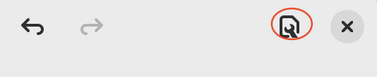

# Style Sheets

Since Gaphor 2.0, diagrams can have a different look by means of style
sheets. Style sheets use the Cascading Style Sheets (CSS) syntax. CSS is used
to describe the presentation of a document written in a markup language, and is
most commonly used with HTML for web pages.

On the [W3C CSS home page](https://www.w3.org/Style/CSS/Overview.en.html), CSS
is described as:

> Cascading Style Sheets (CSS) is a simple mechanism for adding style (e.g.,
fonts, colors, spacing) to Web documents.

Its application goes well beyond web documents, though. Gaphor uses CSS to
provide style elements to items in diagrams. CSS allows us, users of Gaphor, to
change the visual appearance of our diagrams. Color and line styles can be
changed to make it easier to read the diagrams.

Since we're dealing with a diagram, and not a HTML document, some CSS features
have been left out.

The style is part of the model, so everyone working on a model will have the
same style. To edit the style press the tools page button at the top right corner
in gaphor:



Here is a simple example of how to change the background color of a class:

``` css
class {
  background-color: beige;
}
```

```{diagram} class
:model: style-sheets
:alt: background beige
```

Or change the color of a component, only when it's nested in a node:

``` css
node component {
  background-color: skyblue;
}
```

```{diagram} node-component
:model: style-sheets
:alt: nested component
```

The diagram itself is also expressed as a CSS node. It's pretty easy to define
a "dark" style:

``` css
diagram {
  background-color: #343131;
}

* {
  color: white;
  text-color: white;
}
```

```{diagram} dark
:model: style-sheets
:alt: dark-style
:class: dark-style
:name: dark-style
```

Here you already see the first custom attribute: `text-color`. This property
allows you to control the color of the text drawn in an item. `color` is used
for the lines (strokes) that make the layout of a diagram item.

## Supported selectors

Since we are dealing with diagrams and models, we do not need all the features
of CSS. Below you'll find a summary of all CSS features supported by Gaphor.

```{eval-rst}
============================= ============================
``*``                         All items on the diagram, including the diagram itself.
``node component``            Any component item which is a descendant of a node.
``node > component``          A component item which is a child of a node.
``.item``                     Each diagram item has a class "item" assigned.
                              This makes it easy to differentiate them from e.g. name elements.
``generalization[subject]``   A generalization item with a subject present.
``class[name=Foo]``           A class with name "Foo".
``diagram[name^=draft]``      A diagram with a name starting with "draft".
``diagram[name$=draft]``      A diagram with a name ends with "draft".
``diagram[name*=draft]``      A diagram with a name containing the text "draft".
``diagram[name~=draft item]`` A diagram with a name of "draft" or "item".
``diagram[name|=draft]``      A diagram with a name is "draft" or starts with "draft-".
``:focus``                    The focused item. Other pseudo classes are:

                              - ``:active`` selected items
                              - ``:hover`` for the item under the mouse
                              - ``:drop`` if an item is dragged and can be dropped on this item
                              - ``:disabled`` if an element is grayed out during handle movement
``:empty``                    A node containing no child nodes in the diagram.
``:root``                     Refers to the diagram itself.

                              This is only applicable for the diagram
``:first-child``              A node is the first element among a group of sibling.
``:has()``                    The item contains any of the provided selectors.

                              E.g. ``node:has(component)``: a node containing a component item.
``:is()``                     Match any of the provided selectors.

                              E.g. ``:is(node, subsystem) > component``: a node or subsystem.
``:not()``                    Negate the selector.

                              E.g. ``:not([subject])``: Any item that has no "subject".
``::after``                   Provide extra content after a text.
                              Only the ``content`` property is supported.
============================= ============================
```

* The official specification of [CSS3 attribute selectors](https://www.w3.org/TR/2018/REC-selectors-3-20181106/#attribute-selectors).
* Gaphor provides the `|=` attribute selector for the sake of completeness. It's
  probably not very useful in this context, though.
* Please note that Gaphor CSS does not support IDs for diagram items, so the
  CSS syntax for IDs (`#some-id`) is not used. Also, class syntax
  (`.some-class`) is not supported currently.

## Style properties

Gaphor supports a subset of CSS properties and some Gaphor specific properties.
The style sheet interpreter is relatively straight forward. All
widths, heights, and sizes are measured in pixels. You can’t use complex style
declarations, like the `font` property in HTML/CSS which can contain font
family, size, weight.

Some properties are inherited from the parent style. The parent often is a diagram.
When you set a `color`` or a `font-family` on `diagram`, it will propagate down
to the items contained in the diagram.

### Colors

```{eval-rst}
======================= =======================================
``background-color``    Examples:

                        ``background-color: azure;``

                        ``background-color: rgb(255, 255, 255);``

                        ``background-color: hsl(130, 95%, 10%);``
``color``               Color used for lines. *(inherited)*
``text-color``          Color for text. *(inherited)*

                        .. deprecated:: 2.23.0 Use color if possible.
``opacity``             Color opacity factor (``0.0`` - ``1.0``),
                        applied to all colors.
======================= =======================================
```

* A color can be any [CSS3 color code](https://www.w3.org/TR/2018/REC-css-color-3-20180619/),
  as described in the CSS documentation. Gaphor supports all color notations:
  `rgb()`, `rgba()`, `hsl()`, `hsla()`, Hex code (`#ffffff`) and color names.

### Text and fonts

```{eval-rst}
======================= =======================================
``font-family``         A single font name (e.g. ``sans``, ``serif``, ``courier``). *(inherited)*
``font-size``           An absolute size (e.g. ``14``) or a size value (e.g. ``small``). *(inherited)*
``font-style``          Either ``normal`` or ``italic``. *(inherited)*
``font-weight``         Either ``normal`` or ``bold``. *(inherited)*
``text-align``          Either ``left``, ``center``, ``right``. *(inherited)*
``text-decoration``     Either ``none`` or ``underline``.
``vertical-align``      Vertical alignment for text.

                        Either ``top``, ``middle`` or ``bottom``.
``vertical-spacing``    Set vertical spacing for icon-like items (actors, start state).

                        Example: ``vertical-spacing: 4``.
``white-space``         Change the line wrapping behavior for text. *(inherited)*
======================= =======================================
```

* `font-family` can be only one font name, not a list of (fallback) names, as
  is used for HTML.
* `font-size` can be a number or [CSS absolute-size values](https://drafts.csswg.org/css-fonts-3/#font-size-prop).
  Only the values `x-small`, `small`, `medium`, `large` and `x-large` are supported.

### Drawing and spacing

```{eval-rst}
======================= =======================================
``border-radius``       Radius for rectangles: ``border-radius: 4``.
``dash-style``          Style for dashed lines: ``dash-style: 7 5``.
``justify-content``     Content alignment for boxes.

                        Either ``start``, ``end``, ``center`` or ``stretch``.
``line-style``          Either ``normal`` or ``sloppy [factor]``.
``line-width``          Set the width for lines: ``line-width: 2``. *(inherited)*
``min-height``          Set minimal height for an item: ``min-height: 50``.
``min-width``           Set minimal width for an item: ``min-width: 100``.
``max-width``           Set maximum width (text fields only): ``max-width: 100``.
``padding``             CSS style padding (top, right, bottom, left).

                        Example: ``padding: 3 4``.
======================= =======================================
```

* `padding` is defined by integers in the range of 1 to 4. No unit (px, pt, em)
  needs to be used. All values are in pixel distance.
* `dash-style` is a list of numbers (line, gap, line, gap, …)
* `line-style` only has an effect when defined on a `diagram`. A sloppiness
  factor can be provided in the range of -2 to 2.

### Pseudo elements

Currently, only the `::after` pseudo element is supported.

```{eval-rst}
======================= =======================================
``content``             Extra content to be shown after a text.
======================= =======================================
```

### Variables

Since Gaphor 2.16.0 you can use [CSS variables](https://developer.mozilla.org/en-US/docs/Web/CSS/Using_CSS_custom_properties) in your style sheets.

This allows you to define often used values in a more generic way. Think of things
like line dash style and colors.

The `var()` function has some limitations:

* Values can’t have a default value.
* Variables can’t have a variable as their value.

Example:

```css
diagram {
  --bg-color: whitesmoke;
  background-color: var(--bg-color);
}

diagram[diagramType=sd] {
  --bg-color: rgb(200, 200, 255);
}
```

All diagrams have a white background. Sequence diagrams get a blue-ish background.

### Media queries

Gaphor supports dark and light mode since 2.16.0. Dark and light color schemes are exclusively used
for on-screen editing. When exporting images, only the default color scheme is applied.
Color schemes can be defined with `@media` queries. The official `prefers-color-scheme = dark` query is supported,
as well as a more convenient `dark-mode`.

```css
/* The background you see in exported diagrams: */
diagram {
  background-color: transparent;
}

/* Use a slightly grey background in the editor: */
@media light-mode {
  diagram {
    background-color: #e1e1e1;
  }
}

/* And anthracite a slightly grey background in the editor: */
@media dark-mode {
  diagram {
    background-color: #393D47;
  }
}
```

### Diagram styles

Only a few properties can be defined on a diagram, namely `background-color`
and `line-style`. You define the diagram style separately from the diagram item
styles. That way it's possible to set the background color for diagrams
specifically. The line style can be the normal straight lines, or a more
playful "sloppy" style. For the sloppy style an optional wobliness factor can
be provided to set the level of line wobbliness. 0.5 is default, 0.0 is a
straight line. The value should be between -2.0 and 2.0. Values between 0.0 and
0.5 make for a subtle effect.

## CSS model elements

Gaphor has many model elements. How can you find out which item should be styled?

Gaphor only styles the elements that are in the model, so you should be explicit
on their names. For example: `Component` inherits from `Class` in the UML model,
but changing a color for `Class` does not change it for `Component`.

If you hover over a button the toolbox (bottom-left section), a popup will appear
with the item's name and a shortcut. As a general rule, you can use the component
name, glued together as the name in the stylesheet.
A *Component* can be addressed as `component`, *Use Case* as
`usecase`. The name matching is case insensitive.
CSS names are written in lower case by default.

However, since the CSS element names are derived from names used within Gaphor, there are a few exceptions.

```{eval-rst}
========  ============  ===================  =============================
Profile   Group         Element              CSS element
========  ============  ===================  =============================
\*        \*            *element name*       element name without spaces

                                             E.g. ``class``, ``usecase``.
UML       Classes       all Association's    ``association``
UML       Components    Device/Node          ``node``
UML       Actions       Decision/Merge Node  ``decisionnode``
UML       Actions       Fork/Join Node       ``forknode``
UML       Actions       Swimlane             ``partition``
UML       Interactions  Reflexive message    ``message``
UML       States        Initial Pseudostate  ``pseudostate``
UML       States        History Pseudostate  ``pseudostate``
UML       Profiles      Metaclass            ``class``
C4 Model  C4 Model      Person               ``c4person``
C4 Model  C4 Model      Software System      ``c4container[type="Software System"]``
C4 Model  C4 Model      Component            ``c4container[type="Component"]``
C4 Model  C4 Model      Container            ``c4container[type="Container"]``
C4 Model  C4 Model      Container: Database  ``c4database``
SysML     Blocks        ValueType            ``datatype``
SysML     Blocks        Primitive            ``datatype``
SysML     Requirements  Derive Requirement   ``derivedreq``
RAAML     FTA           any AND/OR/… Gate    ``and``, ``or``, etc.
========  ============  ===================  =============================
```


## Ideas

Here are some ideas that go just beyond changing a color or a font. With the
following examples we dig in to Gaphor's model structure to reveal more
information to the users.

To create your own expression you may want to use the Console ( → Tools → Console). Drop us a line on
[Gitter](https://gitter.im/gaphor/Lobby) and we would be happy to help you.

### The drafts package

All diagrams in the package "Drafts" should be drawn using sloppy lines:

```css
diagram[owner.name=drafts] {
  line-style: sloppy 0.3;
}

diagram[owner.name=drafts] * {
  font-family: Purisa; /* Or use some other font that's installed on your system */
}
```

```{diagram} draft
:model: style-sheets
:alt: draft style
```

### Wrap long attributes, operations, and stereotype values

Sometimes attribute values get a bit lengthy. By default, Gaphor will not
wrap text. If you want to, you can add this little snippet to wrap text for
lengthy attributes on classes. You can also apply this to other types, of course.

```css
class * {
 white-space: normal;
}
```

```{diagram} wrap-text
:model: style-sheets
:alt: wrap long attribute
```

### Unconnected relationships

All items on a diagram that are not backed by a model element, should be drawn
in a dark red color. This can be used to spot not-so-well connected
relationships, such as Generalization, Implementation, and Dependency.
These items will only be backed by a model element once you connect both line
ends. This rule will exclude simple elements, like lines and boxes, which will
never have a backing model element.

```css
:not(:is(:root, line, box, ellipse, commentline))[subject=""] {
  color: firebrick;
}
```

```{diagram} unconnected
:model: style-sheets
:alt: unconnected relationship
```

### Navigable associations

An example of how to apply a style to a navigable association is to color an
association blue if neither of the ends are navigable. This color could act as
a validation rule for a model where at least one end of each association should
be navigable. This is actually the case for the model file used to create
Gaphor's data model.

```css
association:not([memberEnd.navigability*=true]) {
  color: blue;
}
```

```{diagram} navigable-association
:model: style-sheets
:alt: navigable association
```

### Solid Control Flow lines

In Gaphor, Control Flow lines follow the SysML styling: dashed.
If you want, or need to strictly follow the official UML specifications,
you can simply make those solid lines.

```css
controlflow {
  dash-style: 0;
}
```

```{diagram} controlflow
:model: style-sheets
:alt: control flow
```

### Todo note highlight

All comments beginning with the phrase "todo" can be highlighted in
a different user-specific colour. This can be used to make yourself aware
that you have to do some additional work to finalize the diagram.

```css
comment[body^="TODO"] {
  background-color: skyblue;
}
```

```{diagram} todo
:model: style-sheets
:alt: highlighted todo note
```

### Emphesize abstract classes and operations

It may be that the italic font used is not distinguishable enough to differentiate between
concrete and abstract classes or operations.
To make this work we check if the `isAbstract` attribute is set on the element:

```css
:is(name, operation)[isabstract]::after {
  content: " {abstract}"
}
```

```{diagram} abstract
:model: style-sheets
:alt: emphasize abstract elements
```

## System Style Sheet

```{literalinclude} ../gaphor/diagram.css
:language: css
```
