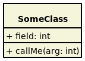
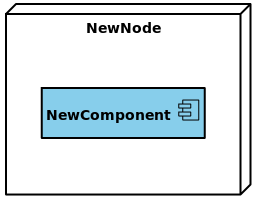

# Style Sheets

Since Gaphor 2.0, Gaphor diagrams can have a different look by means of style
sheets. Style sheets use the Cascading Style Sheets (CSS) syntax. CSS is used
to describe the presentation of a document written in a markup language, and is
most commonly used with HTML for web pages.

On the [W3C CSS home page](https://www.w3.org/Style/CSS/Overview.en.html), CSS
is described as:

> Cascading Style Sheets (CSS) is a simple mechanism for adding style (e.g.,
fonts, colors, spacing) to Web documents.

Its application goes well beyond web documents, though. Gaphor uses CSS to
provide style elements to items in diagrams. CSS allows us, users of Gaphor, to
change the visual appearance of our diagrams. Color and line styles can be
changed to make it easier to read the diagrams.

Since we're dealing with a diagram, and not a HTML document, some CSS features
have been left out.

The style is part of the model, so everyone working on a model will have the
same style.

Here is a simple example of how to change the background color of a class:

``` css
class {
  background-color: beige;
}
```



Or change the color of a component, only when it's nested in a node:

``` css
node component {
  background-color: skyblue;
}
```



The diagram itself is also expressed as a CSS node. It's pretty easy to define
a "dark" style:

``` css
diagram {
  background-color: black;
}

* {
  color: white;
  text-color: white;
}
```

<p>
 <span style="display: inline-block; background-color: black; padding: 16px">
  
 </span>
</p>

Here you already see the first custom attribute: `text-color`. This property
allows you to control the color of the text drawn in an item. `color` is used
for the lines (strokes) that make the layout of a diagram item.

## Supported selectors

Since we are dealing with diagrams and models, we do not need all the features
of CSS. Below you'll find a summary of all CSS features supported by Gaphor.

```eval_rst
============================= ============================
``*``                         All items on the diagram, including the diagram itself.
``node component``            Any component item which is a descendant of a node.
``node > component``          A component item which is a child of a node.
``generaliation[subject]``    A generalization item with a subject present.
``class[name=Foo]``           A class with name "Foo".
``diagram[name^=draft]``      A diagram with a name starting with "draft".
``diagram[name$=draft]``      A diagram with a name ends with "draft".
``diagram[name*=draft]``      A diagram with a name containing the text "draft".
``diagram[name~=draft item]`` A diagram with a name of "draft" or "item".
``diagram[name|=draft]``      A diagram with a name is "draft" or starts with "draft-".
``\*:focus``                  The focused item. Other pseudo classes are:

                              - ``:active`` selected items
                              - ``:hover`` for the item under the mouse
                              - ``:drop`` if an item is dragged and can be dropped on this item
``node:empty``                A node containing no child nodes in the diagram.
``:root``                     An item is at the top level of the diagram.

                              This is only applicable for the diagram
``:has()``                    The item contains any of the provided selectors.

                              E.g. ``node:has(component)``: a node containing a component item.
``:is()``                     Match any of the provided selectors.

                              E.g. ``:is(node, subsystem) > component``: a node or subsystem.
``:not()``                    Negate the selector.

                              E.g. ``:not([subject])``: Any item that has no "subject".
============================= ============================
```

* The official specification of [CSS3 attribute selectors](https://www.w3.org/TR/2018/REC-selectors-3-20181106/#attribute-selectors).
* We provide the `|=` attribute selector for the sake of completeness. It's
  probably not very useful in a Gaphor context.
* Please note that Gaphor CSS does not support IDs for diagram items, so the
  CSS syntax for IDs (`#some-id`) is not used. Also, class syntax
  (`.some-class`) is not supported.

## Style properties

Gaphor supports a subset of CSS properties and some Gaphor specific properties.
The style sheet interpreter is relatively straight forward. We measure all
widths, heights, and sizes in pixels. We don't support complex style
declarations, like the `font` property in HTML/CSS which can contain font
family, size, weight.

### Colors

```eval_rst
.. |br| raw:: html

   <br />

======================= =======================================
``background-color``    Examples: |br|
                        ``background-color: azure;`` |br|
                        ``background-color: rgb(255, 255, 255);`` |br|
                        ``background-color: hsl(130, 95%, 10%);``
``color``               Color used for lines
``text-color``          Color for text
``opacity``             Color opacity factor (``0.0`` - ``1.0``),
                        applied to all colors
======================= =======================================
```

* A color can be any [CSS3 color code](https://www.w3.org/TR/2018/REC-css-color-3-20180619/),
  as described in the CSS documentation. We support all color notations:
  `rgb()`, `rgba()`, `hsl()`, `hsla()`, Hex code (`#ffffff`) and color names.

### Text and fonts

```eval_rst
======================= =======================================
``font-family``         A single font name (e.g. ``sans``, ``serif``, ``courier``)
``font-size``           An absolute size (e.g. ``14``) or a size value (e.g. ``small``)
``font-style``          Either ``normal`` or ``italic``
``font-weight``         Either ``normal`` or ``bold``
``text-align``          Either ``left``, ``center``, ``right``
``text-decoration``     Either ``none`` or ``underline``
``vertical-align``      Vertical alignment for text

                        Either ``top``, ``middle`` or ``bottom``
``vertical-spacing``    Set vertical spacing for icon-like items (actors, start state)

                        Example: ``vertical-spacing: 4``
======================= =======================================
```

* `font-family` can be only one font name, not a list of (fallback) names, as
  is used for HTML.
* `font-size` can be a number or [CSS absolute-size values](https://drafts.csswg.org/css-fonts-3/#font-size-prop).
  Only the values `x-small`, `small`, `medium`, `large` and `x-large` are supported.

### Drawing and spacing

```eval_rst
======================= =======================================
``border-radius``       Radius for rectangles: ``border-radius: 4``
``dash-style``          Style for dashed lines: ``dash-style: 7 5``
``line-style``          Either ``normal`` or ``sloppy [factor]``
``line-width``          Set the width for lines: ``line-width: 2``
``min-height``          Set minimal height for an item: ``min-height: 50``
``min-width``           Set minimal width for an item: ``min-width: 100``
``padding``             CSS style padding (top, right, bottom, left)

                        Example: ``padding: 3 4``
======================= =======================================
```

* `padding` is defined by integers in the range of 1 to 4. No unit (px, pt, em)
  needs to be used. All values are in pixel distance.
* `dash-style` is a list of numbers (line, gap, line, gap, ...)
* `line-style` only has an effect when defined on a `diagram`. A sloppiness
  factor can be provided in the range of -2 to 2.

### Diagram styles

Only a few properties can be defined on a diagram, namely `background-color`
and `line-style`. We define the diagram style separately from the diagram item
styles. That way it's possible to set the background color for diagrams
specifically. The line style can be the normal straight lines, or a more
playful "sloppy" style. For the sloppy style an optional wobliness factor can
be provided to set the level of line wobbliness. 0.5 is default, 0.0 is a
straight line. The value should be between -2.0 and 2.0. Values between 0.0 and
0.5 make for a subtle effect.

## Ideas

Here are some ideas that go just beyond changing a color or a font. With the
following examples we dig in to Gaphor's model structure to reveal more
information to the users.

To create your own expression you may want to use the Console (Tools ->
Console, in the Hamburger menu). Drop us a line on
[Gitter](https://gitter.im/gaphor/Lobby) and we would be happy to help you.

### The drafts package

All diagrams in the package "Drafts" should be drawn using sloppy lines:

```css
diagram[namespace.name=drafts] {
  line-style: sloppy 0.3;
}

diagram[name=draft] * {
  font-family: Purisa; /* Or use some other font that's installed on your system */
}
```


### Unconnected relationships

All items on a diagram that are not backed by a model element, should be drawn
in a dark red color. This can be used to spot not-so-well connected
relationships, such as Generalization, Implementation, and Dependency.
These items will only be backed by a model element once you connect both line
ends. This rule will exclude simple elements, like lines and boxes, which will
never have a backing model element.

```css
:not([subject], :is(line, box, ellipse, commentline)) {
  color: firebrick;
}
```


### Navigable associations

An example of how to apply a style to a navigable association is to color an
association blue if neither of the ends are navigable. This color could act as
a validation rule for a model where at least one end of each association should
be navigable. This is actually the case for the model file used to create
Gaphor's data model.

```css
association:not([memberEnd.navigability*=true]) {
 color: blue;
}
```

